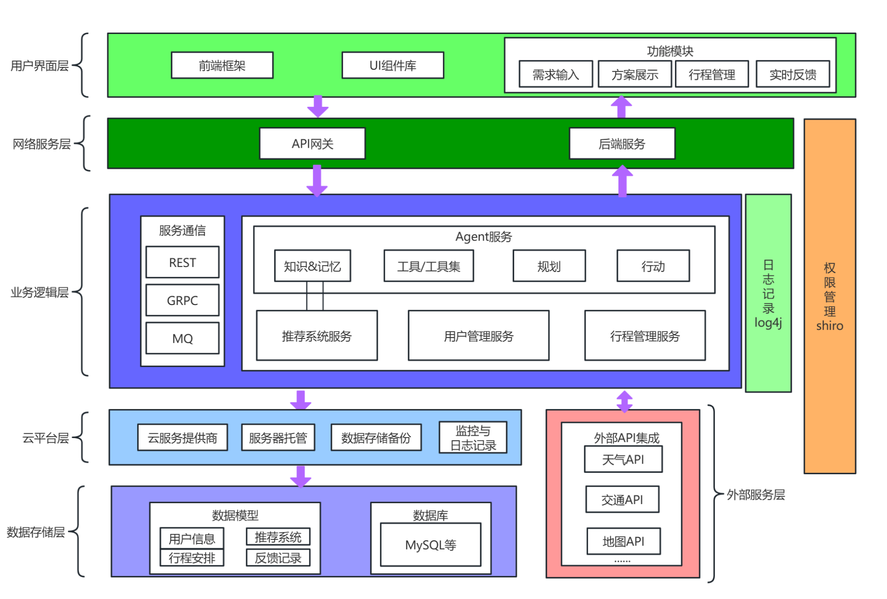
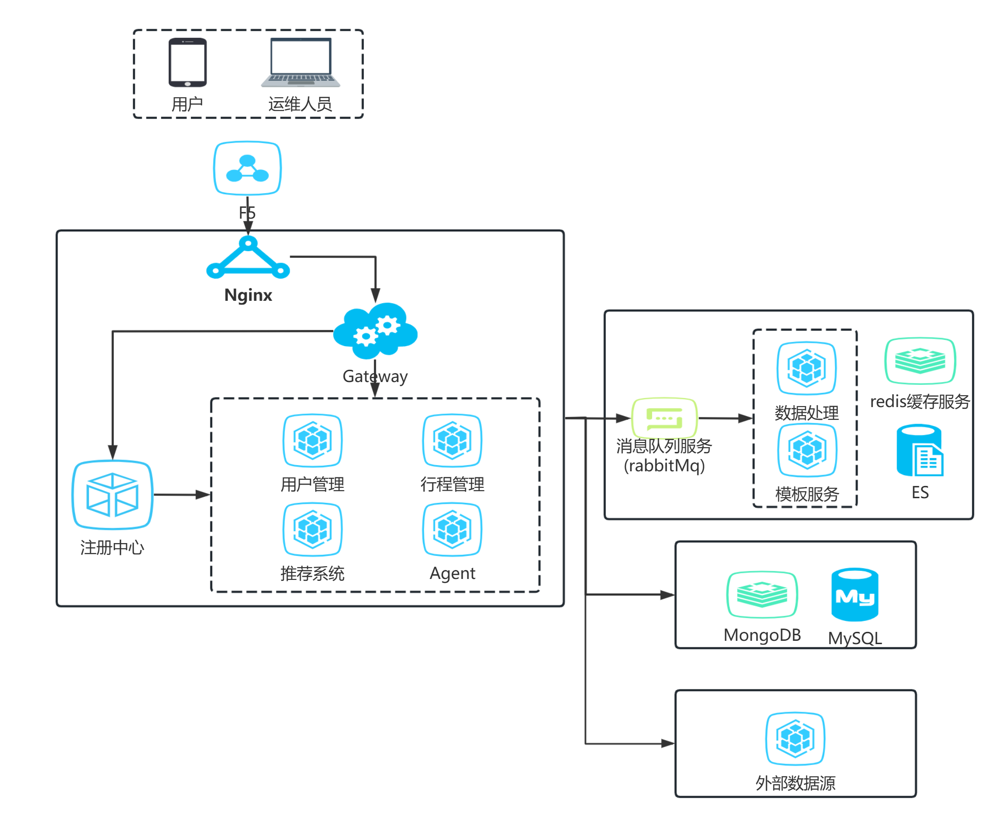

# README.md

### **注意事项**

项目安装与前后端连接测试教程现在可以先参考：[https://blog.csdn.net/m0_74141663/article/details/143171899?spm=1001.2014.3001.5501。](https://blog.csdn.net/m0_74141663/article/details/143171899?spm=1001.2014.3001.5501%E3%80%82)

目前已实现前后端连接

> 以下按照微服务架构进行开发与部署说明：

### 架构设计



### 部署设计



## 用户界面层

- 界面结构待说明

## 网络服务层

| API 管理工具/文档 | 待选   |
| ----------------- | ------ |
| 负载均衡          | 待实践 |

## 业务逻辑及外部服务层

| 功能模块     | 开发状态                                                                          |
| ------------ | --------------------------------------------------------------------------------- |
| 用户管理服务 | 用户登录与注册功能已实现，完善建议见前端代码                                      |
| 行程管理服务 | 行程方案输出格式规范中；天气 API 数据已整合；下一步将进行查找删除等基础功能的实现 |
| 推荐系统服务 | 暂定 RecBole，功能待集成                                                          |
| Agent 服务   | 基于 Langchain，文件结构已定，功能开发中                                          |
| 数据库       | MySQL 框架已搭建，MongoDB 待调研，远程连接/部署待启动                             |

## 云平台层

| 部署任务       | 开发状态 |
| -------------- | -------- |
| 容器化         | 待进行   |
| 云平台部署     | 待调研   |
| 域名（宣传任务 | 待申请   |

## 数据存储层

| 总览               | 后端与数据库连接已实现，MySQL 框架已搭建，MongoDB 待调研，远程连接/部署待启动 |
| ------------------ | ----------------------------------------------------------------------------- |
| 用户个人信息数据库 | MySQL，待连接                                                                 |
| 用户画像数据库     | MySQL，待连接                                                                 |
| 推荐系统内容数据库 | 暂定 RecBole                                                                  |
| 行程管理数据库     | MySQL（暂定                                                                   |
| Agent 记忆库       | 可能是 Redis，但这个 Langchain 会提供                                         |

## 文件结构

```
WanderWiser_backend
├─ app.js
├─ bin
│  └─ www
├─ config
│  └─ dbconfig.js
├─ controllers
│  ├─ testController.js
│  ├─ userCenterController.js
│  ├─ userLoginController.js
│  └─ weatherController.js
├─ Function
│  └─ utilityFunctions.js
├─ images
│  ├─ architecture.png
│  └─ deploy.png
├─ package-lock.json
├─ package.json
├─ public
│  └─ stylesheets
│     └─ style.css
├─ README.md
├─ routes
│  ├─ test.js
│  ├─ userCenter.js
│  ├─ userLogin.js
│  └─ weather.js
└─ views
   ├─ error.ejs
   ├─ error.jade
   ├─ index.jade
   └─ layout.jade

```
